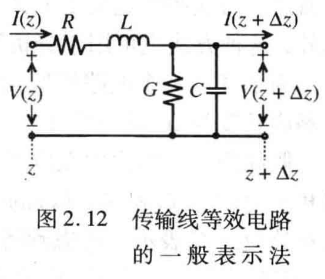

Welcome 👋



## 传输线理论的实质
根据电压波的一般表达式
$$\mathbf{V}(z, t) = V_0 e^{j(\omega t - kz)} = V_0 \cos(\omega t -kz) $$
该表达式以一种方式将空间和时间结合在一起，其空间特性由沿着Z轴的波长$\lambda$来描述，时间特性则由沿着时间轴的周期$T$来描述。数学上称之为相对于时间的空间变化，也就是运动速度。其相速为：
$$v_p = \frac{\omega}{k} = \frac{1}{\sqrt{\mu \varepsilon}} =\lambda f = \frac{c}{\sqrt{\varepsilon_r \mu_r}}$$
假设一个电路由内阻为$R_G$的正弦电压源$V_G$通过1.5cm长的铜导线与负载电阻$R_L$相连接，$\varepsilon_r=10$, $\mu_r=1$。如下图：

**在不考虑导线电阻的情况下：**
当信号频率为1MHz时，$v_p = 9.49 \times 10^7 m/s$。得到$\lambda = 94.86 m$。那么连接信号源与负载的导线即可忽略不计。
当信号频率提高到10GHz时，$\lambda = 0.949 cm$。此时，沿着1.5cm的导线测量电压，空间位置就成为确定信号相位的决定性因素。  
示波器通道2的探头从A点移动到B点，可以发现信号的相位相对位移了两个周期。

上面分析的前提时忽略导线的电阻，**实际高频下必须考虑电压和电流的空间分布，需要将导线进行微分处理。**

> 一般认为当电路元件的特征尺寸超过波长的1/10时，就需要用分布参数来代替集总参数理论。
例如对于$l=1.5cm$的铜导线，当频率大于633MHz时，就需要采用基于分布参数的传输线理论来进行分析。
$$f = \frac{v_p}{10l}= 633MHz$$
## 常见的传输线
|传输线种类	|支持模式	|频率范围	|典型应用|
|----|----|----|----|
|同轴电缆	|TEM	|DC - GHz	|射频信号传输、视频通信|
|平行双线	|TEM	|DC - MHz	|天线馈线、低频传输|
|微带线	|准TEM	|MHz - GHz	|无线通信、射频电路|
|波导	|TE/TM	|GHz - THz	|雷达、卫星通信、高频微波|
|条带线	|准TEM	|MHz - GHz	|高频集成电路设计|
|双绞线	|TEM	|DC - MHz	|电话通信、局域网布线|
|光纤	|光波（光学模式）	|THz	|长距离高速数据通信|
|天线馈线	|多种模式	|DC - GHz	|信号从发射机到天线的传输|

常见同轴电缆的损耗
|电缆类型|	频率 (MHz)|	损耗 (dB/100m)|	备注|
|----|----|----|----|
|RG58|	100	|10.7	|标准低功率同轴电缆|
||1000|	70.7	|高频下损耗显著增加|
|RG59|	100	|6.5	|用于视频和低频信号传输|
|LMR-400	|100	|2.7	|优化后的低损耗同轴电缆|
||1000	|8.7|	广泛应用于无线通信设备|
|RG213	|100	|3.9	|用于射频和通信应用|
||1000	|17.5||	
|同轴波导电缆|	GHz 波段|	< 1.0|	用于微波通信，极低损耗|

## 等效电路模型

为了简化计算，通常会把两个导体的电阻和电容分别组合为一个元件。如下图：

但是，该简化模型并不适用于所有类型的传输线。当涉及瞬态信号的传播及感性、容性串扰产生的信号完整性问题，通常需要采用2.11.的参数表示法并增加一个电感接地。  

---
RG58A 是一种常见的 50 欧姆同轴电缆，用于射频通信等领域。要计算这种同轴电缆的单位长度电感 $L'$ 和单位长度电容 $C'$，我们需要基于其结构参数和电磁特性。  
对于同轴电缆，其单位长度电感 $L'$ 和单位长度电容 $C'$ 的表达式如下：  
**单位长度电感 $L'$：**
$$L' = \frac{\mu}{2\pi} \ln\left(\frac{b}{a}\right),$$
**单位长度电容 $C'$：**
$$C' = \frac{2\pi\epsilon}{\ln\left(\frac{b}{a}\right)},$$
其中：
- $a$：内导体的半径（单位：米）。
- $b$：外导体的内半径（单位：米）。
- $\mu$：介质的磁导率（通常为自由空间磁导率 $\mu_0 = 4\pi \times 10^{-7} \, \mathrm{H/m}$）。
- $\epsilon$：介质的电容率（取决于绝缘材料，通常为 $\epsilon = \epsilon_r \cdot \epsilon_0$，其中 $\epsilon_0 = 8.854 \times 10^{-12} \, \mathrm{F/m}$ 为真空电容率，$\epsilon_r$ 为相对介电常数）。

根据 RG58A 的规格手册，这种电缆的几何参数为：
- **内导体直径 $d_\text{inner}$**：$0.81 \, \text{mm}$，因此 $a = d_\text{inner}/2 = 0.405 \, \text{mm} = 0.000405 \, \text{m}$。
- **外导体内直径 $d_\text{outer}$**：$2.95 \, \text{mm}$，因此 $b = d_\text{outer}/2 = 1.475 \, \text{mm} = 0.001475 \, \text{m}$。
- **绝缘介质的相对介电常数 $\epsilon_r$**：通常为 $2.25$（聚乙烯材料）。
---
$L' = \frac{\mu_0}{2\pi} \ln\left(\frac{b}{a}\right).$
其中：
- $\mu_0 = 4\pi \times 10^{-7} \, \mathrm{H/m}$；
- $\ln\left(\frac{b}{a}\right) = \ln\left(\frac{0.001475}{0.000405}\right) = \ln(3.64) \approx 1.2916$。

代入计算：
$L' = \frac{4\pi \times 10^{-7}}{2\pi} \cdot 1.2916 = 2 \times 10^{-7} \cdot 1.2916 = 2.583 \times 10^{-7} \, \mathrm{H/m}.$

即：
$L' \approx 258.3 \, \mathrm{nH/m}.$

$C' = \frac{2\pi\epsilon}{\ln\left(\frac{b}{a}\right)}.$
其中：
- $\epsilon = \epsilon_r \cdot \epsilon_0 = 2.25 \cdot (8.854 \times 10^{-12}) = 1.992 \times 10^{-11} \, \mathrm{F/m}$；
- $\ln\left(\frac{b}{a}\right) = 1.2916$。

代入计算：
$C' = \frac{2\pi \cdot 1.992 \times 10^{-11}}{1.2916} = \frac{1.251 \times 10^{-10}}{1.2916} = 9.69 \times 10^{-11} \, \mathrm{F/m}.$

即：
$C' \approx 96.9 \, \mathrm{pF/m}.$

---
特性阻抗 $Z_0$ 可通过以下公式验证：
$Z_0 = \sqrt{\frac{L'}{C'}}.$
代入计算：
$Z_0 = \sqrt{\frac{258.3 \times 10^{-9}}{96.9 \times 10^{-12}}} = \sqrt{2666.67} \approx 51.63 \, \Omega.$

这与 RG58A 的标称特性阻抗 $50 \, \Omega$ 非常接近，表明计算结果合理。

## License

Copyright 2024-Salmon